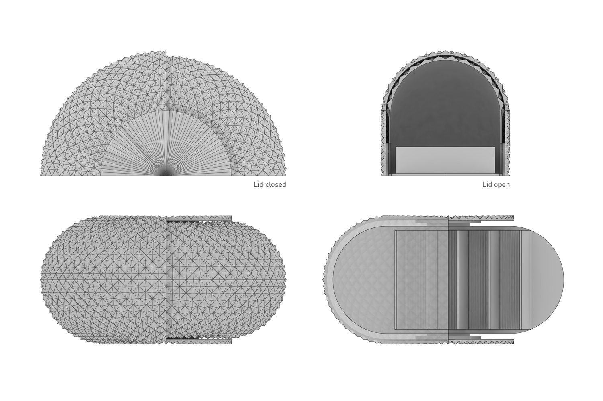

## About

### Technology
IOM harnesses recent robotic fabrication technologies to autonomously build and assemble complex products - including devices with circuits, actuators, and motors. It’s not rapid prototyping, it’s rapid production. 

Products are fabricated in a vertically integrated robotic ecosystem. Upon completion, they are are deposited in purpose-built boxes for immediate shipping. 

Production Cycle:
1. Receive purchase order 
2. 3D-print part housing
3. Insert stock components 
4. Complete and test final assembly
5. Package for delivery

### Applications

- Long-tail part manufacture
- Order fulfillment
- Product packaging
- Assembly line part sorting

---

## Sample Products

### Consumer Goods

Business Card Holder

Smart Alarm Clock

Rotary Phone

---

## Intellectual Property

IOM’s methods are patent protected across the production cycle. Competitors should find it hard to develop alternative methods to accomplish similar tasks.  

**Pending Patents**
- Kirgami-governed cylinder deformation in robotic arms
- Current-regulated variable friction gripping 
- Dynamic spherical gantry system
- Rotary filament switching in 3D-printer extruder heads
- Method for developing load-tolerant packaging 

<!-- 
Page template forked from <a href="https://github.com/evanca/quick-portfolio">evanca</a>
 -->
<!-- Remove above link if you don't want to attibute -->
