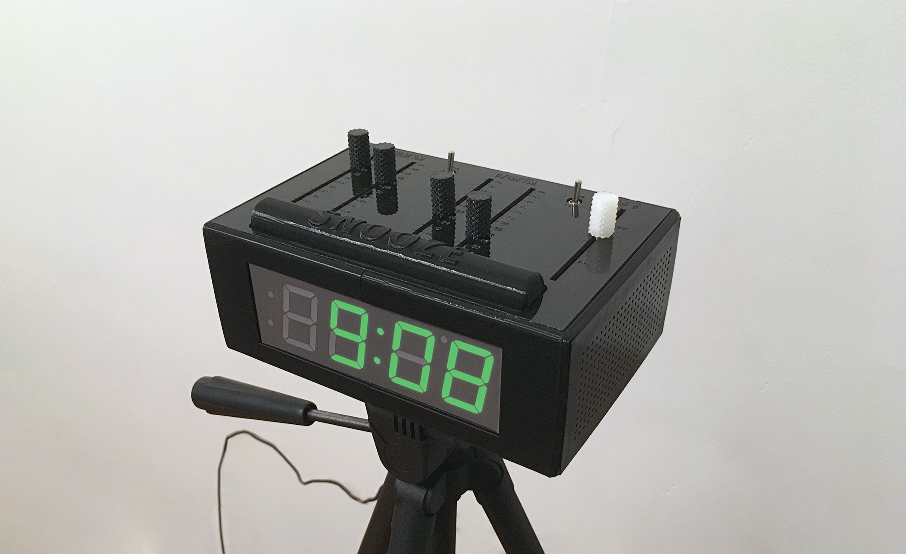

## About

### Technology
IOM harnesses recent robotic fabrication technologies to autonomously build and assemble complex products - including devices with circuits, actuators, and motors. It’s not rapid prototyping, it’s rapid production. 

Products are fabricated in a vertically integrated robotic ecosystem. Upon completion, they are are deposited into purpose-built boxes for immediate shipping. 

Part Lifecycle
1. Receive purchase order 
2. 3D-print part housing
3. Insert stock components 
4. Complete and test final assembly
5. Package for delivery

### [Applications](https://www.google.com)
**Use cases**
- Long-tail part manufacture
- Order fulfillment
- Product packaging
- Assembly line part sorting

---

## Sample Products

### Consumer Goods

[Smart Alarm Clock](https://www.reggieraye.com/smart-alarm-clock)

---
[Rotary Telehone](https://www.reggieraye.com/resistance-phone)

---
[Business Card Holder](https://www.reggieraye.com/card-holder)

---

<!-- 
Page template forked from <a href="https://github.com/evanca/quick-portfolio">evanca</a>
 -->
<!-- Remove above link if you don't want to attibute -->
